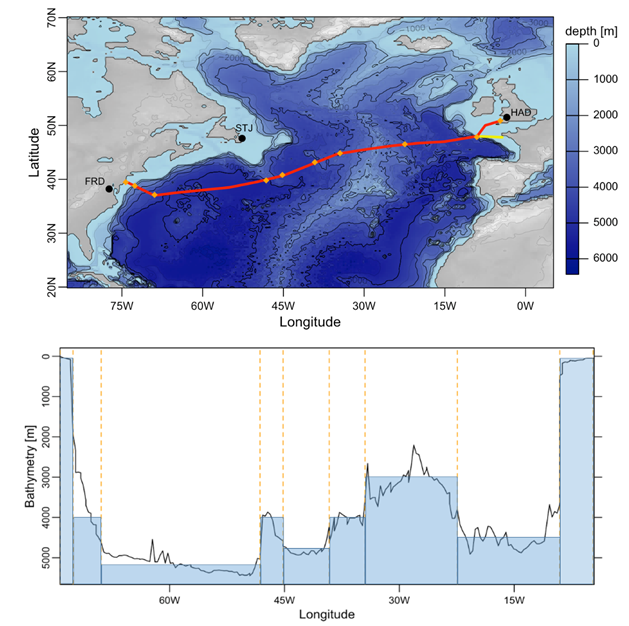

<!-- 
Author(s): Shibaji Chakraborty, Xueling Shi

Disclaimer:
SCUBAS is under the MIT license found in the root directory LICENSE.md 
Everyone is permitted to copy and distribute verbatim copies of this license 
document.

This version of the MIT Public License incorporates the terms
and conditions of MIT General Public License.
-->
The aim of this event study is to revisit the topic of geomagnetic induction in submarine cables using SCUBAS, incorporating the latest insights gained from magnetotelluric studies and investigations of geomagnetically induced currents (GIC) in power systems. By examining a range of fundamental aspects related to the induction process, we seek to enhance our understanding of this phenomenon. We delved into various fundamental issues surrounding the process of geomagnetic induction. These include the underlying principles and mechanisms that govern the induction process, such as the interaction between Earth's magnetic field and the conductive layers present in the Earth's crust and mantle lithosphere. By exploring these fundamental aspects, we aim to establish a solid foundation for our subsequent analysis.

SCUBAS is a comprehensive theoretical framework for calculating the voltages experienced by submarine cables during geomagnetic disturbances. This theory takes into account various factors, including the conductivity structure of the Earth, the characteristics of the magnetic field perturbations, and the geometric properties of the cables. By leveraging this theoretical framework, we can quantify and predict the magnitudes of induced voltages on submarine cables in response to geomagnetic disturbances.

To illustrate the practical application of our theory, we specifically focus on the TAT-8 trans-Atlantic cable and examine the voltages it experienced during the magnetic storm that occurred in March 1989. Using our developed theory, we calculate the expected voltages on the cable during this event. We then compare these calculated values with the actual voltages observed on the cable during the storm. This comparative analysis allows us to evaluate the accuracy and reliability of our theoretical predictions, providing insights into the performance and behavior of submarine cables under geomagnetic disturbances. 

By combining theoretical analysis, practical calculations, and empirical observations, we aim to advance our understanding of the effects of geomagnetic induction on submarine cables. This research not only contributes to the broader scientific knowledge in this field but also has practical implications for the design, operation, and maintenance of submarine cable systems, helping to ensure their resilience and reliability in the face of geomagnetic disturbances. Here is a sample code that shows how to run SCUBAS to generate the results. For data files and configurations please check [GitHub](https://img.shields.io/github/v/release/shibaji7/SCUBAS).

!!! Example Code    
    ``` py
    # Import all required libs
    import matplotlib as mpl
    import matplotlib.pyplot as plt
    # Set matplotlib styles
    plt.style.use(["science", "ieee"])
    plt.rcParams["font.family"] = "sans-serif"
    plt.rcParams["font.sans-serif"] = ["Tahoma", "DejaVu Sans",
                                       "Lucida Grande", "Verdana"]
    import pandas as pd

    # Import SCUBAS dependencies
    from scubas.datasets import PROFILES
    from scubas.models import OceanModel
    from scubas.plotlib import plot_transfer_function,\
            potential_along_section, cable_potential, update_rc_params
    from scubas.cables import TransmissionLine, Cable
    from scubas.conductivity import ConductivityProfile as CP
    
    # Check Calculations from SW 1989 paper
    stns, coords = ["FRD", "STJ", "HAD"], ["XYZ", "XYZ", "HDZ"]
    db="input/data/{year}/"
    dates, frames = [dt.datetime(1989,3,12),dt.datetime(1989,3,13),dt.datetime(1989,3,14)], {}
    for stn, coord in zip(stns, coords):
        o = pd.DataFrame()
        for d in dates:
            f = db.format(year=d.year) + "{stn}_{date}_{coord}.txt".format(stn=stn, 
                                                                           date=d.strftime("%Y%m%d"), 
                                                                           coord=coord)
            o = pd.concat([o, bezpy.mag.read_iaga(f)])
        frames[stn] = o

    # Create cable by each cable sections
    tlines = []
    tlines.append(
        TransmissionLine(
            sec_id="CS-W",
            directed_length=dict(
                edge_locations=dict(
                    initial=dict(lat=39.6, lon=-74.33), 
                    final=dict(lat=38.79, lon=-72.62)
                )
            ),
            elec_params=dict(
                site=PROFILES.CS_W,
                width=1.0,
                flim=[1e-6, 1e0],
            ),
            active_termination=dict(
                right=None,
                left=PROFILES.LD,
            ),
        ).compile_oml([
            "input/data/1989/FRD_19890312_XYZ.txt",
            "input/data/1989/FRD_19890313_XYZ.txt",
            "input/data/1989/FRD_19890314_XYZ.txt",
        ]),
    )
    tlines.append(
        TransmissionLine(
            sec_id="DO-1",
            directed_length=dict(
                edge_locations=dict(
                    initial=dict(lat=38.79, lon=-72.62), 
                    final=dict(lat=37.11, lon=-68.94)
                )
            ),
            elec_params=dict(
                site=PROFILES.DO_1,
                width=1.0,
                flim=[1e-6, 1e0],
            ),
            active_termination=dict(
                right=None,
                left=None,
            ),
        ).compile_oml([
            "input/data/1989/FRD_19890312_XYZ.txt",
            "input/data/1989/FRD_19890313_XYZ.txt",
            "input/data/1989/FRD_19890314_XYZ.txt",
        ])
    )
    tlines.append(
        TransmissionLine(
            sec_id="DO-2",
            directed_length=dict(
                edge_locations=dict(
                    initial=dict(lat=37.11, lon=-68.94), 
                    final=dict(lat=39.80, lon=-48.20)
                )
            ),
            elec_params=dict(
                site=PROFILES.DO_2,
                width=1.0,
                flim=[1e-6, 1e0],
            ),
            active_termination=dict(
                right=None,
                left=None,
            ),
        ).compile_oml([
            "input/data/1989/STJ_19890312_XYZ.txt",
            "input/data/1989/STJ_19890313_XYZ.txt",
            "input/data/1989/STJ_19890314_XYZ.txt",
        ])
    )
    tlines.append(
        TransmissionLine(
            sec_id="DO-3",
            directed_length=dict(
                edge_locations=dict(
                    initial=dict(lat=39.80, lon=-48.20), 
                    final=dict(lat=40.81, lon=-45.19)
                )
            ),
            elec_params=dict(
                site=PROFILES.DO_3,
                width=1.0,
                flim=[1e-6, 1e0],
            ),
            active_termination=dict(
                right=None,
                left=None,
            ),
        ).compile_oml([
            "input/data/1989/STJ_19890312_XYZ.txt",
            "input/data/1989/STJ_19890313_XYZ.txt",
            "input/data/1989/STJ_19890314_XYZ.txt",
        ])
    )
    tlines.append(
        TransmissionLine(
            sec_id="DO-4",
            directed_length=dict(
                edge_locations=dict(
                    initial=dict(lat=40.81, lon=-45.19), 
                    final=dict(lat=43.15, lon=-39.16)
                )
            ),
            elec_params=dict(
                site=PROFILES.DO_4,
                width=1.0,
                flim=[1e-6, 1e0],
            ),
            active_termination=dict(
                right=None,
                left=None,
            ),
        ).compile_oml([
            "input/data/1989/STJ_19890312_XYZ.txt",
            "input/data/1989/STJ_19890313_XYZ.txt",
            "input/data/1989/STJ_19890314_XYZ.txt",
        ])
    )
    tlines.append(
        TransmissionLine(
            sec_id="DO-5",
            directed_length=dict(
                edge_locations=dict(
                    initial=dict(lat=43.15, lon=-39.16), 
                    final=dict(lat=44.83, lon=-34.48)
                )
            ),
            elec_params=dict(
                site=PROFILES.DO_5,
                width=1.0,
                flim=[1e-6, 1e0],
            ),
            active_termination=dict(
                right=None,
                left=None,
            ),
        ).compile_oml([
            "input/data/1989/STJ_19890312_XYZ.txt",
            "input/data/1989/STJ_19890313_XYZ.txt",
            "input/data/1989/STJ_19890314_XYZ.txt",
        ])
    )
    tlines.append(
        TransmissionLine(
            sec_id="MAR",
            directed_length=dict(
                edge_locations=dict(
                    initial=dict(lat=44.83, lon=-34.48), 
                    final=dict(lat=46.51, lon=-22.43)
                )
            ),
            elec_params=dict(
                site=PROFILES.MAR,
                width=1.0,
                flim=[1e-6, 1e0],
            ),
            active_termination=dict(
                right=None,
                left=None,
            ),
        ).compile_oml([
            "input/data/1989/STJ_19890312_XYZ.txt",
            "input/data/1989/STJ_19890313_XYZ.txt",
            "input/data/1989/STJ_19890314_XYZ.txt",
        ])
    )
    tlines.append(
        TransmissionLine(
            sec_id="DO-6",
            directed_length=dict(
                edge_locations=dict(
                    initial=dict(lat=46.51, lon=-22.43), 
                    final=dict(lat=47.85, lon=-9.05)
                )
            ),
            elec_params=dict(
                site=PROFILES.DO_6,
                width=1.0,
                flim=[1e-6, 1e0],
            ),
            active_termination=dict(
                right=None,
                left=None,
            ),
        ).compile_oml([
            "input/data/1989/HAD_19890312_HDZ.txt",
            "input/data/1989/HAD_19890313_HDZ.txt",
            "input/data/1989/HAD_19890314_HDZ.txt",
        ])
    )
    tlines.append(
        TransmissionLine(
            sec_id="CS-E",
            directed_length=dict(
                edge_locations=dict(
                    initial=dict(lat=47.85, lon=-9.05), 
                    final=dict(lat=50.79, lon=-4.55)
                )
            ),
            elec_params=dict(
                site=PROFILES.CS_E,
                width=1.0,
                flim=[1e-6, 1e0],
            ),
            active_termination=dict(
                right=PROFILES.LD,
                left=None,
            ),
        ).compile_oml([
            "input/data/1989/HAD_19890312_HDZ.txt",
            "input/data/1989/HAD_19890313_HDZ.txt",
            "input/data/1989/HAD_19890314_HDZ.txt",
        ])
    )
    
    # Generate Plots
    params = cable.tot_params
    segment_name = ["CS-W", "DO-1", "DO-2", "DO-3", "DO-4", "DO-5", "MAR", "DO-6", "CS-E"]
    stations = ["FRD", "FRD", "STJ", "STJ", "STJ", "STJ", "STJ", "HAD", "HAD"]

    import matplotlib as mpl
    import matplotlib.pyplot as plt
    plt.style.use(["science", "ieee"])
    plt.rcParams["font.family"] = "sans-serif"
    plt.rcParams["font.sans-serif"] = ["Tahoma", "DejaVu Sans",
                                       "Lucida Grande", "Verdana"]

    import matplotlib.dates as mdates
    from matplotlib.dates import DateFormatter

    fig, axes = plt.subplots(nrows=2, ncols=1, dpi=240, figsize=(5, 8), sharex=True)
    multiplier, colors = np.array([4,3,2,1,0,-1,-2,-3,-4])*3.5, ["r", "k", "b"]
    colors = ["#1f77b4", "#ff7f0e", "#2ca02c", "#d62728", "#9467bd", 
              "#8c564b", "#e377c2", "#7f7f7f", "#bcbd22", "#17becf"]
    base=90
    for i in range(9):
        ax = axes[0]
        ax.text(0.05, 1.05, "Date: 13-14 March 1989", ha="left", va="bottom", transform=ax.transAxes)
        ax.set_xlim(dt.datetime(1989,3,13), dt.datetime(1989,3,14,12))
        ax.xaxis.set_major_formatter(DateFormatter(r"%H UT"))
        ax.xaxis.set_major_locator(mdates.HourLocator(byhour=range(0, 24, 12)))
        #ax.xaxis.set_minor_formatter(DateFormatter("%H UT"))
        ax.xaxis.set_minor_locator(mdates.HourLocator(byhour=range(0, 24, 1)))
        ax.plot(
            params.index, 
            (base*multiplier[i])+params["E.X.%02d"%(i)]-np.mean(params["E.X.%02d"%(i)]), 
            colors[i], 
            ls="-", 
            lw=0.6
        )
        ax.set_xticklabels([])
        ax.set_ylabel(r"$E_x$ [mV/km]", fontdict={"color": "k"})
        ax.set_ylim(-1500,1500)
        ax.text(-0.06,0.2,"(a)",ha="left",va="bottom",transform=ax.transAxes)
        if i==0:
            ax.axvline(params.index.tolist()[-1100], ymin=18.5/30, ymax=20.5/30, 
                       color = "darkgreen", drawstyle="steps-mid")
            ax.axhline(350, xmin=0.82, xmax=0.82+1e-2, color = "darkgreen")
            ax.axhline(550, xmin=0.82, xmax=0.82+1e-2, color = "darkgreen")
            ax.text(params.index.tolist()[2800], 425, "200 mV/km", ha="left", va="center", 
                    fontdict={"color": "darkgreen", "size":10})
        ax.set_yticklabels([])
        ax.legend(loc=2)
        ax = axes[1]
        ax.set_xlim(dt.datetime(1989,3,13), dt.datetime(1989,3,14,12))
        ax.xaxis.set_major_formatter(DateFormatter(r"%H UT"))
        ax.xaxis.set_major_locator(mdates.HourLocator(byhour=range(0, 24, 12)))
        #ax.xaxis.set_minor_formatter(DateFormatter("%H UT"))
        ax.xaxis.set_minor_locator(mdates.HourLocator(byhour=range(0, 24, 1)))
        txt = r"%s[%s]"%(segment_name[i], stations[i])
        ax.plot(
            params.index, 
            (base*multiplier[i])+params["E.Y.%02d"%(i)]-np.mean(params["E.Y.%02d"%(i)]), 
            colors[i], 
            ls="-", 
            lw=0.6, 
            label=txt
        )
        ax.set_ylabel(r"$E_y$ [mV/km]", fontdict={"color": "k"})
        if i==0:
            ax.axvline(params.index.tolist()[-1100], ymin=18.5/30, ymax=20.5/30, 
                       color = "darkgreen", drawstyle="steps-mid")
            ax.axhline(350, xmin=0.82, xmax=0.82+1e-2, color = "darkgreen")
            ax.axhline(550, xmin=0.82, xmax=0.82+1e-2, color = "darkgreen")
            ax.text(params.index.tolist()[2800], 425, "200 mV/km", ha="left", va="center", 
                    fontdict={"color": "darkgreen", "size":10})
            #ax.axvline(frame.index.tolist()[2000], ymin=4/6, ymax=5/6, color = "darkgreen", drawstyle="steps-mid")
            #ax.axhline(2000, xmin=0.25, xmax=0.25+2e-2, color = "darkgreen")
            #ax.axhline(1000, xmin=0.25, xmax=0.25+2e-2, color = "darkgreen")
            #ax.text(frame.index.tolist()[1970], 1500, "1000 nT", ha="right", va="center", fontdict={"color": "darkgreen", "size":10})
        ax.set_ylim(-1500,1500)
        ax.set_yticklabels([])
        ax.text(-0.06,0.2,"(b)",ha="left",va="bottom",transform=ax.transAxes)
    axes[1].set_xlabel("Time [UT]")
    axes[1].legend(bbox_to_anchor=(1.01, 1), loc="upper left", fontsize=10)
    fig.subplots_adjust(wspace=.1, hspace=.1)
    
    mpl.rcParams.update({"xtick.labelsize": 12, "ytick.labelsize":12, "font.size":12})
    fig, ax = plt.subplots(nrows=1, ncols=1, dpi=240, figsize=(6, 4), sharex=True)
    ax.set_xlim(dt.datetime(1989,3,13), dt.datetime(1989,3,14,12))
    ax.xaxis.set_major_formatter(DateFormatter(r"%H UT"))
    ax.xaxis.set_major_locator(mdates.HourLocator(byhour=range(0, 24, 12)))
    ax.xaxis.set_minor_locator(mdates.HourLocator(byhour=range(0, 24, 1)))
    ax.plot(params.index, params["V(v)"]+2100, "darkgreen", ls="-", lw=1.5, label=r"$\mathcal{E}_C$", alpha=0.7)
    ax.plot(params.index, params["U0"]+1400, "r", ls="-", lw=2, alpha=0.4, label=r"$U_W$")
    ax.plot(params.index, params["U1"]+700, "b", ls="-", lw=2, alpha=0.4, label=r"$U_E$")
    ax.plot(params.index, params["V(v)"]+(params["U0"]-params["U1"]), "k", ls="-", lw=1., label=r"$V_{TAT-8}$")
    ax.set_ylim(-600, 2700)
    ax.set_xlabel("Time [UT]")
    ax.set_ylabel("Potentials [Volts]")
    ax.text(0.05, 1.05, "Date: 13-14 March 1989", ha="left", va="bottom", transform=ax.transAxes)
    #ax.legend(bbox_to_anchor=(1.01, 1), loc="upper left")
    ax.set_yticklabels([])
    ax.text(dt.datetime(1989,3,14,11), params["U0"].iloc[-1]+1500, r"$U_W$", ha="right", va="bottom")
    ax.text(dt.datetime(1989,3,14,11), params["U1"].iloc[-1]+800, r"$U_E$", ha="right", va="bottom")
    ax.text(dt.datetime(1989,3,14,11), params["V(v)"].iloc[-1]+2200, r"$\mathcal{E}_C$", ha="right", va="bottom")
    ax.text(dt.datetime(1989,3,14,11), (params["V(v)"]+(params["U0"]-params["U1"])).iloc[-1], r"$V_{TAT-8}$", 
            ha="right", va="bottom")
    ax.axvline(dt.datetime(1989,3,13,16), ymin=2700/3300, ymax=3200/3300, color = "k", drawstyle="steps-mid")
    ax.axhline(2700-600, xmin=0.43, xmax=0.43+3e-2, color = "k")
    ax.axhline(3200-600, xmin=0.43, xmax=0.43+3e-2, color = "k")
    ax.text(dt.datetime(1989,3,13,15,50), 2300, "500 V", ha="right", va="center", fontdict={"color": "k", "size":10})
    ```