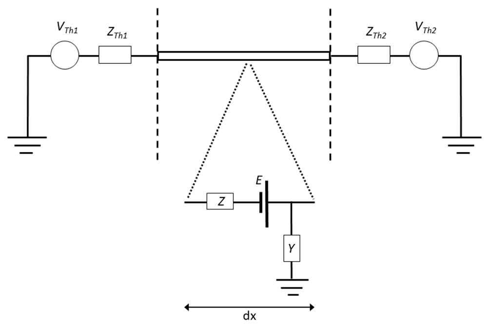
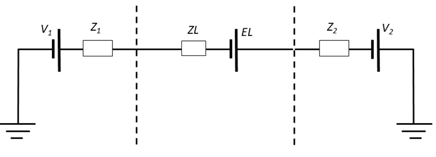

<!-- 
Author(s): Shibaji Chakraborty, Xueling Shi

Disclaimer:
SCUBAS is under the MIT license found in the root directory LICENSE.md 
Everyone is permitted to copy and distribute verbatim copies of this license 
document.

This version of the MIT Public License incorporates the terms
and conditions of MIT General Public License.
-->
#### Transmission Line with 'Active' Terminations
---

When studying electromagnetic induction in a transmission line with multiple sections, it can be convenient to simplify the analysis by considering each section individually. To do this, we can represent the sections on either side of a specific section using their Thevenin equivalent circuits.

The Thevenin equivalent circuit is a simplified model that replaces a complex network of components with a single voltage source and a single equivalent impedance. It allows us to analyze a portion of a larger circuit as if it were a self-contained system.In the context of electromagnetic induction in a transmission line, the Thevenin equivalent circuit represents the behavior of the adjacent sections on either side of a particular section. It captures the combined effect of those sections, providing a simplified representation that can be easily analyzed.

The figure here likely illustrates the transmission line with multiple sections, and it shows how each section can be represented by its Thevenin equivalent circuit. This approach allows for a more manageable analysis of the electromagnetic induction phenomenon. By breaking down the transmission line into smaller sections and representing them with their Thevenin equivalent circuits, we can study the induction process in a step-by-step manner. This simplification enables us to analyze the impact of each section on the overall behavior of the transmission line, making the analysis more tractable and facilitating a better understanding of the electromagnetic phenomena involved. Transmission Line with distributed series impedance, $Z$, parallel admittance, $Y$, and voltage sources representing the electric field, $E$, with 'active' terminations at each end represented by Thevenin equivalent circuits.



In this case, electromagnetic induction in the transmission line in 'Active Termination' figure can be represented by the circuit shown in following figure. 

The current along the transmission line is then given by:

$$
I=\frac{V_1+EL+V_2}{Z_1+ZL+Z_2}
$$

The potential at the left end of the transmission line is then:

$$
U_1=V_1-IZ_1
$$

And the potential at the right end of the transmission line is:

$$
U_2=IZ_2-V_2
$$

!!! Example Code
    ``` py
    # Import all required libs
    import matplotlib as mpl
    import matplotlib.pyplot as plt
    # Set matplotlib styles
    plt.style.use(["science", "ieee"])
    plt.rcParams["font.family"] = "sans-serif"
    plt.rcParams["font.sans-serif"] = ["Tahoma", "DejaVu Sans",
                                       "Lucida Grande", "Verdana"]
    import pandas as pd

    # Import SCUBAS dependencies
    from scubas.datasets import PROFILES
    from scubas.models import OceanModel
    from scubas.plotlib import plot_transfer_function,\
            potential_along_section, cable_potential, update_rc_params
    from scubas.cables import TransmissionLine, Cable
    from scubas.conductivity import ConductivityProfile as CP

    # Ocean-Earth conductivity profile of a Deep Ocean
    site = PROFILES.DO_3
    # Rended ocean model
    om = OceanModel(site)
    # Generate transfer function
    tf = om.get_TFs()
    # Transfer function of a Deep Ocean.
    # We are going to use this tranfer function to compute differen electrical cases
    _ = plot_transfer_function(tf)

    ####################################################################
    # Simulating the case: Induced electric field 0.3 V/km on a 
    # shallow continental shelf with depth 100 m, length 600 km
    ####################################################################
    e_CS = pd.DataFrame()
    e_CS["X"], e_CS["dTime"] = [300], [0]
    length=600
    tl = TransmissionLine(
        sec_id="CS",
        directed_length=dict(
            length_north=length,
        ),
        elec_params=dict(
            site=PROFILES.CS,
            width=1.0,
            flim=[1e-6, 1e0],
        ),
        # Added active termination
        active_termination=dict(
            right=PROFILES.LD, # Added Land profiles on either side
            left=PROFILES.LD,
        ),
    )
    tl.compute_eqv_pi_circuit(e_CS, ["X"])
    cable = Cable([tl], ["X"])
    Vc, Lc = cable._pot_along_cable_(0)
    tag = cable_potential(Vc, Lc, ylim=[-200, 200])
    _ = tag["axes"].text(0.05, 0.85, r"$L_{cs}$=%dkm"%length, ha="left",\
                    va="center", transform=tag["axes"].transAxes)
    ```