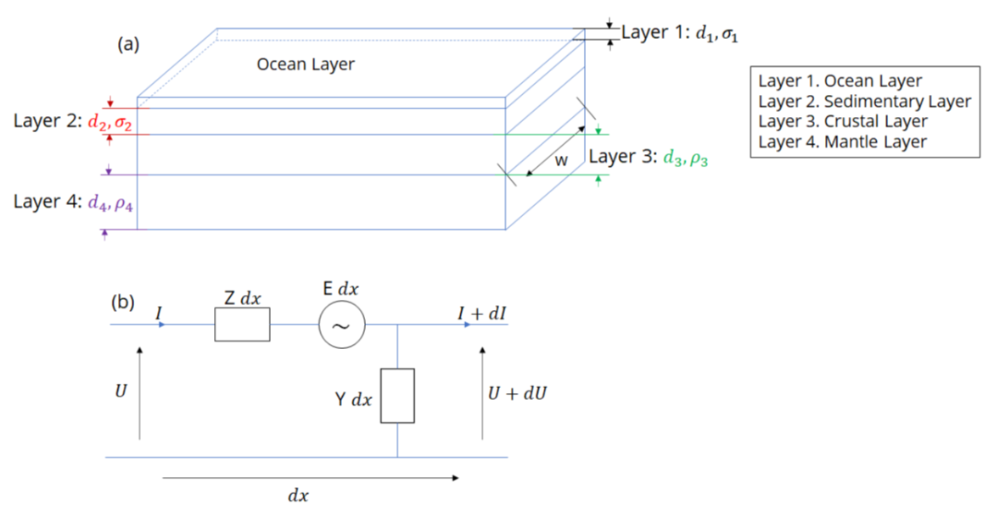

<!-- 
Author(s): Shibaji Chakraborty, Xueling Shi

Disclaimer:
SCUBAS is under the MIT license found in the root directory LICENSE.md 
Everyone is permitted to copy and distribute verbatim copies of this license 
document.

This version of the MIT Public License incorporates the terms
and conditions of MIT General Public License.
-->
#### Transmission Line with “Active” Terminations
---

For electromagnetic induction into a transmission line with multiple sections we can consider a single section as represent the sections on either side by their Thevenin equivalent circuits as shown in the following figure. 