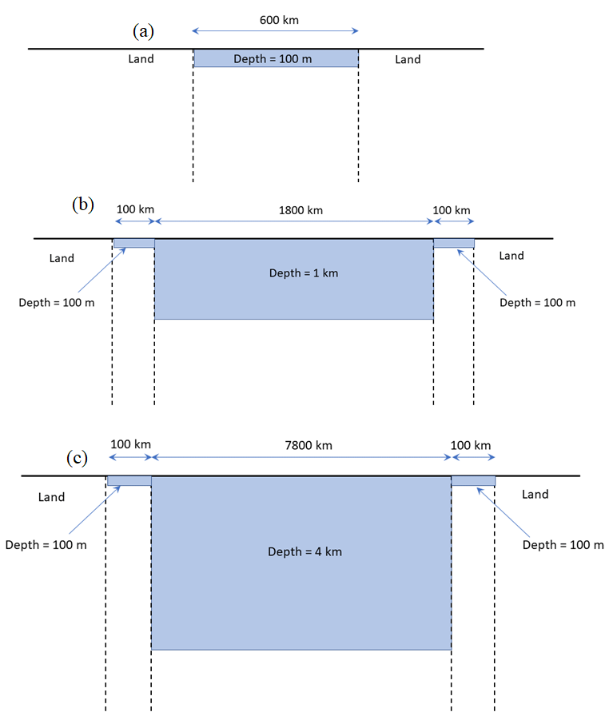

<!-- 
Author(s): Shibaji Chakraborty, Xueling Shi

Disclaimer:
SCUBAS is under the MIT license found in the root directory LICENSE.md 
Everyone is permitted to copy and distribute verbatim copies of this license 
document.

This version of the MIT Public License incorporates the terms
and conditions of MIT General Public License.
-->
#### Example Modelling Example Codes
---
To illustrate the application of the modelling technique and to examine the voltages produced in typical Ocean/Earth conductivity structures we present results for three models representing 1) a shallow sea/continental shelf, 2) a shallow ocean, and 3) a deep ocean.

1. Shallow Sea/Continental Shelf
> This model consists of a shallow sea 600 km wide, with a depth of 100 m, with land at either end  as shown in figure (a). The seawater section has the same properties as the continental shelf in table listed in [network modeling](netmodel.md). This is a simplified model approximation to the North Sea.

2. Shallow Ocean
> This model consists of a deep ocean section 1800 km wide, with a depth of 1 km, with continental shelf 100 km wide and 100 m deep on either side as shown in figure (b). The total width from coast to coast is 2000 km. The parameters for each section are the same as those shown in table listed in [network modeling](netmodel.md), except the ocean section has a seawater depth of 1 km. This is a simplified model approximation of the Tasman Sea.

3. Deep Ocean
> This model consists of a deep ocean section 7800 km wide, with a depth of 4 km, with continental shelf 100 km wide and 100 m deep on either side as shown in Figure (c). The total width from coast to coast is 8000 km. The parameters for each section are as shown in table listed in [network modeling](netmodel.md). This is a simplified model approximation of the Pacific Ocean.

##### Transmission Line Parameters 
For each model the layer thicknesses and resistivities from table in [network modeling](netmodel.md) are used to calculate the transmission line series impedance, $Z$, and parallel admittance, $Y$. These values are then used to calculate the transmission line propagation constant, $\gamma$, characteristic impedance, $Z_0$, and adjustment distance, $\frac{1}{\gamma}$ for each section. The values obtained are shown in table below. The 'Shallow Sea' parameters are used for the continental shelf sections in models 2 and 3 as well as for the seawater section in model 1.

|                    | Depth (m) | $Z$ ($\Omega/km$) | $Y$ (S/km) | $\gamma$ ($km^{-1}$) | $Z_0$ ($\Omega$) | Adj. Distance (km) |
| ------------------ | --------- | ----------------- | ---------- | -------------------- | ---------------- | ------------------ |
| Continental Shelf  | 100       | $7.5\times 10^{-1}$ | $5\times 10^{-6}$ | $1.9365\times 10^{-3}$ | $3.873\times 10^{2}$ | 516.4 |
| Shalow Ocean  | 1000       | $2.5\times 10^{-1}$ | $1.0\times 10^{-5}$ | $1.58\times 10^{-3}$ | $1.58\times 10^{2}$ | 632.5 |
| Deep Ocean  | 4000       | $7.14\times 10^{-1}$ | $1.0\times 10^{-5}$ | $8.45\times 10^{-4}$ | $8.45\times 10^{1}$ | 1183.2 |
| Land  | 0       | 3.0 | $5.0\times 10^{-6}$ | $3.873\times 10^{-3}$ | $7.746\times 10^{2}$ | 258.2 |


!!! Example Code: Continental Shelf/Case 1
    ``` py
    # Import all required libs
    import matplotlib as mpl
    import matplotlib.pyplot as plt
    # Set matplotlib styles
    plt.style.use(["science", "ieee"])
    plt.rcParams["font.family"] = "sans-serif"
    plt.rcParams["font.sans-serif"] = ["Tahoma", "DejaVu Sans",
                                       "Lucida Grande", "Verdana"]
    import pandas as pd

    # Import SCUBAS dependencies
    from scubas.datasets import PROFILES
    from scubas.models import OceanModel
    from scubas.plotlib import plot_transfer_function,\
            potential_along_section, cable_potential, update_rc_params
    from scubas.cables import TransmissionLine, Cable
    from scubas.conductivity import ConductivityProfile as CP
    
    ####################################################################
    # Simulating the case: Induced electric field 0.3 V/km on a 
    # shallow continental shelf with depth 100 m, length 600 km
    ####################################################################
    e_CS = pd.DataFrame()
    e_CS["X"], e_CS["dTime"] = [300], [0]
    length=600
    tl = TransmissionLine(
        sec_id="CS",
        directed_length=dict(
            length_north=length,
        ),
        elec_params=dict(
            site=PROFILES.CS,
            width=1.0,
            flim=[1e-6, 1e0],
        ),
        active_termination=dict(
            right=None,
            left=None,
        ),
    )
    tl.compute_eqv_pi_circuit(e_CS, ["X"])
    cable = Cable([tl], ["X"])
    Vc, Lc = cable._pot_along_cable_(0)
    tag = cable_potential(Vc, Lc, ylim=[-200, 200])
    _ = tag["axes"].text(0.05, 0.85, r"$L_{cs}$=%dkm"%length, ha="left",\
                    va="center", transform=tag["axes"].transAxes)
    ```
    
!!! Example Code: Shallow Ocean/Case 2
    ``` py
    tlines = []
    tlines.append(
        TransmissionLine(
            sec_id="CS1",
            directed_length=dict(
                length_north=100,
            ),
            elec_params=dict(
                site=PROFILES.CS,
                width=1.0,
                flim=[1e-6, 1e0],
            ),
            active_termination=dict(
                right=None,
                left=PROFILES.LD,
            ),
        )
    )
    tlines.append(
        TransmissionLine(
            sec_id="SO",
            directed_length=dict(
                length_north=1800,
            ),
            elec_params=dict(
                site=PROFILES.SO,
                width=1.0,
                flim=[1e-6, 1e0],
            ),
            active_termination=dict(
                right=None,
                left=None,
            ),
        )
    )
    tlines.append(
        TransmissionLine(
            sec_id="CS2",
            directed_length=dict(
                length_north=100,
            ),
            elec_params=dict(
                site=PROFILES.CS,
                width=1.0,
                flim=[1e-6, 1e0],
            ),
            active_termination=dict(
                right=PROFILES.LD,
                left=None,
            ),
        )
    )
    tlines[0].compute_eqv_pi_circuit(e_CS, ["X"])
    tlines[1].compute_eqv_pi_circuit(e_DO, ["X"])
    tlines[2].compute_eqv_pi_circuit(e_CS, ["X"])

    cable = Cable(tlines, ["X"])
        Vc, Lc = cable._pot_along_cable_(0)
    _ = cable_potential(Vc, Lc, ylim=[-60, 60])
    ```
    
!!! Example Code: Deep Ocean/Case 3
    ``` py
    # Compute for deep ocean
    tlines = []
    tlines.append(
        TransmissionLine(
            sec_id="CS1",
            directed_length=dict(
                length_north=100,
            ),
            elec_params=dict(
                site=PROFILES.CS,
                width=1.0,
                flim=[1e-6, 1e0],
            ),
            active_termination=dict(
                right=None,
                left=PROFILES.LD,
            ),
        )
    )
    tlines.append(
        TransmissionLine(
            sec_id="DO",
            directed_length=dict(
                length_north=7800,
            ),
            elec_params=dict(
                site=PROFILES.DO,
                width=1.0,
                flim=[1e-6, 1e0],
            ),
            active_termination=dict(
                right=None,
                left=None,
            ),
        )
    )
    tlines.append(
        TransmissionLine(
            sec_id="CS2",
            directed_length=dict(
                length_north=100,
            ),
            elec_params=dict(
                site=PROFILES.CS,
                width=1.0,
                flim=[1e-6, 1e0],
            ),
            active_termination=dict(
                right=PROFILES.LD,
                left=None,
            ),
        )
    )
    tlines[0].compute_eqv_pi_circuit(e_CS, ["X"])
    tlines[1].compute_eqv_pi_circuit(e_DO, ["X"])
    tlines[2].compute_eqv_pi_circuit(e_CS, ["X"])

    cable = Cable(tlines, ["X"])
    Vc, Lc = cable._pot_along_cable_(0)
    _ = cable_potential(Vc, Lc, ylim=[-120, 120])
    ```
   
#### Boundary Conditions: Calculating Potentials
---
