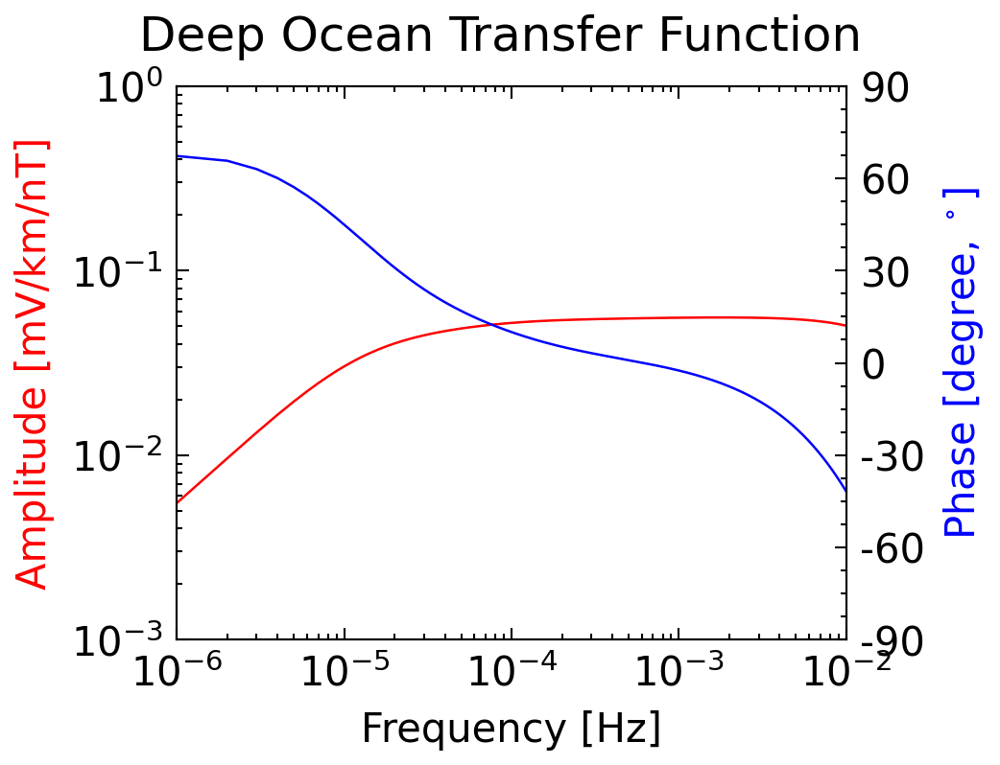
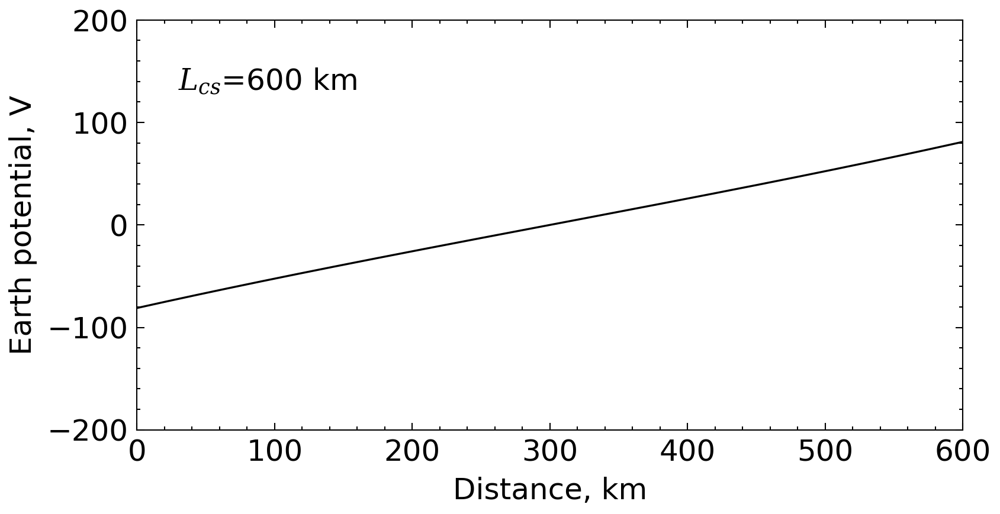
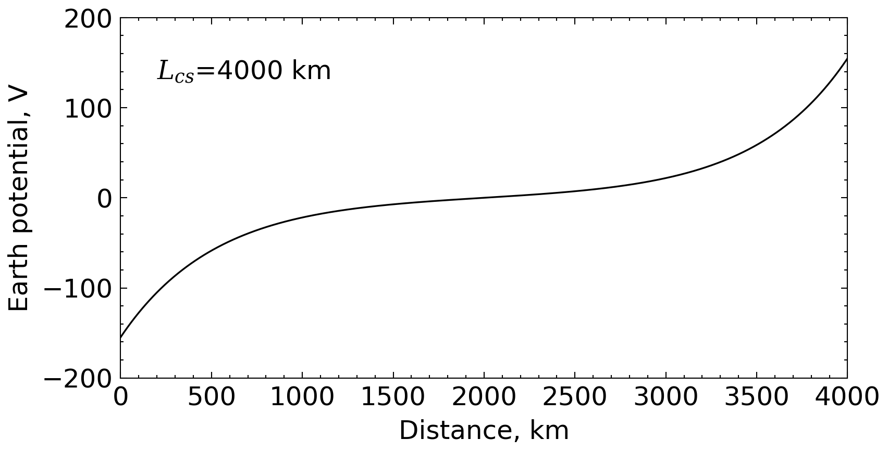

<!-- 
Author(s): Shibaji Chakraborty, Xueling Shi

Disclaimer:
SCUBAS is under the MIT license found in the root directory LICENSE.md 
Everyone is permitted to copy and distribute verbatim copies of this license 
document.

This version of the MIT Public License incorporates the terms
and conditions of MIT General Public License.
-->
#### Electrically Long Cable
---
Consider an Ocean-Earth section with physical length, $L$, and propagation constant, $\gamma$. The section has an adjustment distance $\frac{1}{\gamma}$. For an electrically-long transmission line, where $L>\frac{4}{\gamma}$ (i.e. length is greater than four times of adjustment distance) we have the following scenario,

$$
e^{\gamma L}>>1>>e^{-\gamma L}
$$

When the transmission line length is considerably shorter than the adjustment distance it is referred to as 'electrically-long' and the equivalent-$\pi$ components reduce to (Boteler et a, 2013):

$$
Y_E=\frac{2}{Z_0e^{\gamma L}}
$$

$$
\frac{Y'}{2}=\frac{1}{Z_0}
$$

$$
I_E=\frac{E}{Z}
$$

$$
V_i=-U_k=-\frac{E}{\gamma}
$$

$$
V(x)=Ve^{-\gamma (L-x)}-Ve^{-\gamma x}
$$

where $V_i=-V_k=V=\frac{E}{\gamma}$.

!!! Example    
    ``` py
    from pathlib import Path

    import pandas as pd
    
    from scubas.datasets import PROFILES
    from scubas.models import OceanModel
    from scubas.plotlib import cable_potential, plot_transfer_function, update_rc_params
    from scubas.cables import Cable, TransmissionLine

    figures_dir = Path("docs/tutorial/figures")
    figures_dir.mkdir(parents=True, exist_ok=True)

    update_rc_params(
        {
            "font.family": "sans-serif",
            "font.sans-serif": ["Tahoma", "DejaVu Sans", "Lucida Grande", "Verdana"],
        },
        science=True,
    )

    ocean_model = OceanModel(PROFILES.DO_3)
    transfer_function = ocean_model.get_TFs()
    tf_artifacts = plot_transfer_function(transfer_function)
    tf_artifacts.figure.suptitle("Deep Ocean Transfer Function")
    tf_artifacts.figure.savefig(
        figures_dir / "electrically_cable_transfer_function.png",
        dpi=300,
        bbox_inches="tight",
    )

    ####################################################################
    # Simulating the case: Induced electric field 0.3 V/km on a 
    # shallow continental shelf with depth 100 m, length 600 km
    ####################################################################
    induced_e_field = pd.DataFrame(
        {"X": [300.0]},
        index=pd.RangeIndex(1, name="Time"),
    )

    length = 600.0
    transmission_line = TransmissionLine(
        sec_id="CS-long",
        directed_length={"length_north": length},
        elec_params={"site": PROFILES.CS, "width": 1.0, "flim": [1e-6, 1.0]},
    )
    transmission_line.compute_eqv_pi_circuit(
        Efield=induced_e_field,
        components=["X"],
    )

    cable = Cable([transmission_line], components=["X"])
    potentials, distances = cable._pot_along_cable_(timestamp=0)
    potential_plot = cable_potential(potentials, distances, ylim=(-200, 200))
    potential_plot.axes.text(
        0.05,
        0.85,
        rf"$L_{{cs}}$={length:.0f} km",
        ha="left",
        va="center",
        transform=potential_plot.axes.transAxes,
    )
    potential_plot.figure.savefig(
        figures_dir / "electrically_long_cable_potential.png",
        dpi=300,
        bbox_inches="tight",
    )
    ```

    
    

#### Electrically Short Cable
For an electrically-short section, where the physical length is less than the adjustment distance, i.e., $L<\frac{1}{\gamma}$. When the transmission line length is considerably shorter than the adjustment distance it is referred to as 'electrically-short' and the equivalent-$\pi$ components reduce to (Boteler et a, 2013):

$$
e^{\pm\gamma L}\approx 1\pm\gamma L
$$

$$
Y_E=\frac{1}{Z_0\gamma L}
$$

$$
\frac{Y'}{2}=0
$$

$$
I_E=\frac{E}{Z}
$$

$$
V_i=-V_k=-\frac{LE}{2}=V
$$

$$
V(x)=\frac{V}{2L}(2+\gamma L)(2x-L)
$$

!!! Example
    ``` py
    ####################################################################
    # Simulating the case: Induced electric field 0.3 V/km on a
    # shallow continental shelf with depth 100 m, length 4000 km
    ####################################################################
    from pathlib import Path

    import pandas as pd

    from scubas.cables import Cable, TransmissionLine
    from scubas.datasets import PROFILES
    from scubas.models import OceanModel
    from scubas.plotlib import (
        cable_potential,
        plot_transfer_function,
        update_rc_params,
    )

    figures_dir = Path("docs/tutorial/figures")
    figures_dir.mkdir(parents=True, exist_ok=True)

    update_rc_params(
        {
            "font.family": "sans-serif",
            "font.sans-serif": ["Tahoma", "DejaVu Sans", "Lucida Grande", "Verdana"],
        },
        science=True,
    )

    ocean_model = OceanModel(PROFILES.DO_3)
    transfer_function = ocean_model.get_TFs()
    tf_artifacts = plot_transfer_function(transfer_function)
    tf_artifacts.figure.suptitle("Deep Ocean Transfer Function")
    tf_artifacts.figure.savefig(
        figures_dir / "electrically_cable_transfer_function.png",
        dpi=300,
        bbox_inches="tight",
    )

    induced_e_field = pd.DataFrame(
        {"X": [300.0]},
        index=pd.RangeIndex(1, name="Time"),
    )

    length = 4000.0
    transmission_line = TransmissionLine(
        sec_id="CS-short",
        directed_length={"length_north": length},
        elec_params={"site": PROFILES.CS, "width": 1.0, "flim": [1e-6, 1.0]},
    )
    transmission_line.compute_eqv_pi_circuit(
        Efield=induced_e_field,
        components=["X"],
    )

    cable = Cable([transmission_line], components=["X"])
    potentials, distances = cable._pot_along_cable_(timestamp=0)
    potential_plot = cable_potential(potentials, distances, ylim=[-200, 200])
    potential_plot.axes.text(
        0.05,
        0.85,
        rf"$L_{{cs}}$={length:.0f} km",
        ha="left",
        va="center",
        transform=potential_plot.axes.transAxes,
    )
    potential_plot.figure.savefig(
        figures_dir / "electrically_short_cable_potential.png",
        dpi=300,
        bbox_inches="tight",
    )
    ```

    
