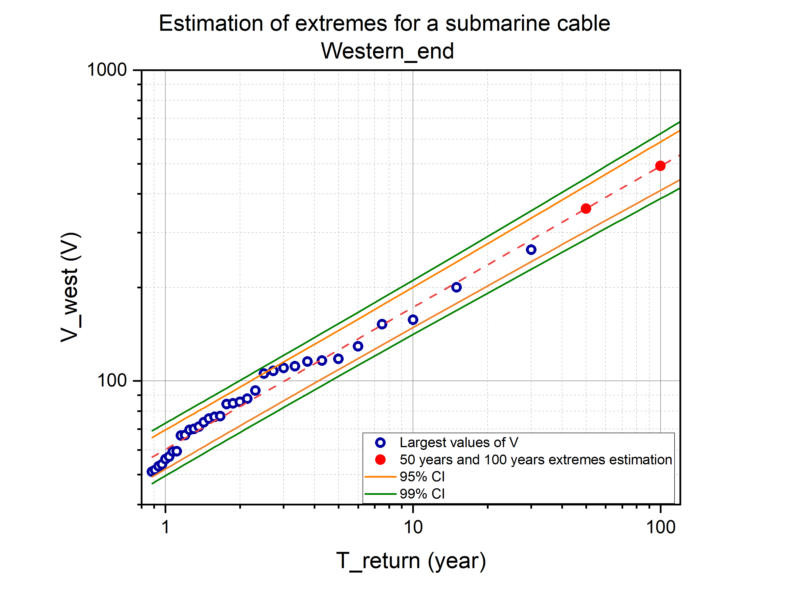
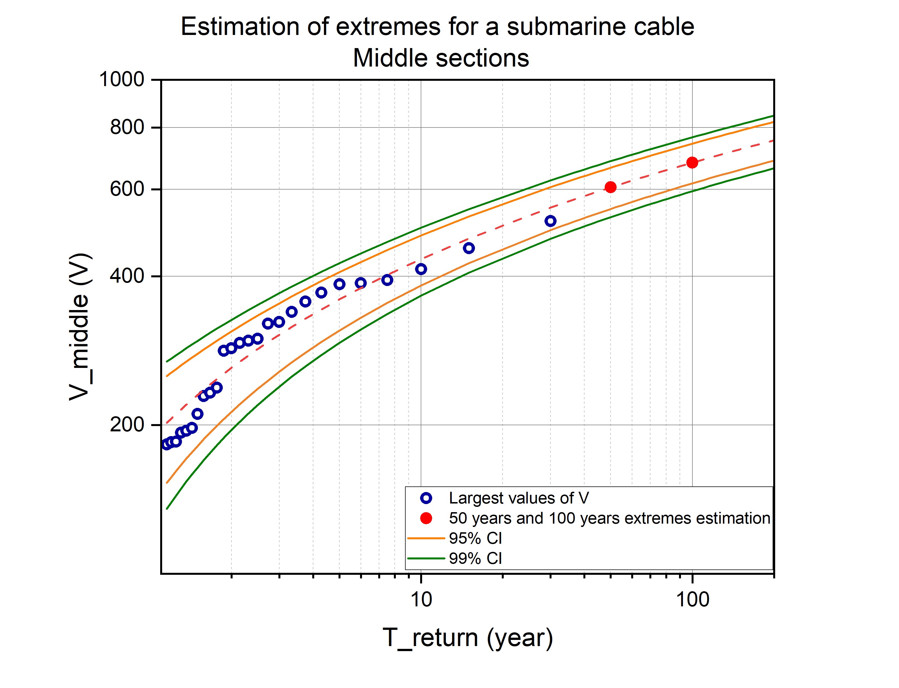
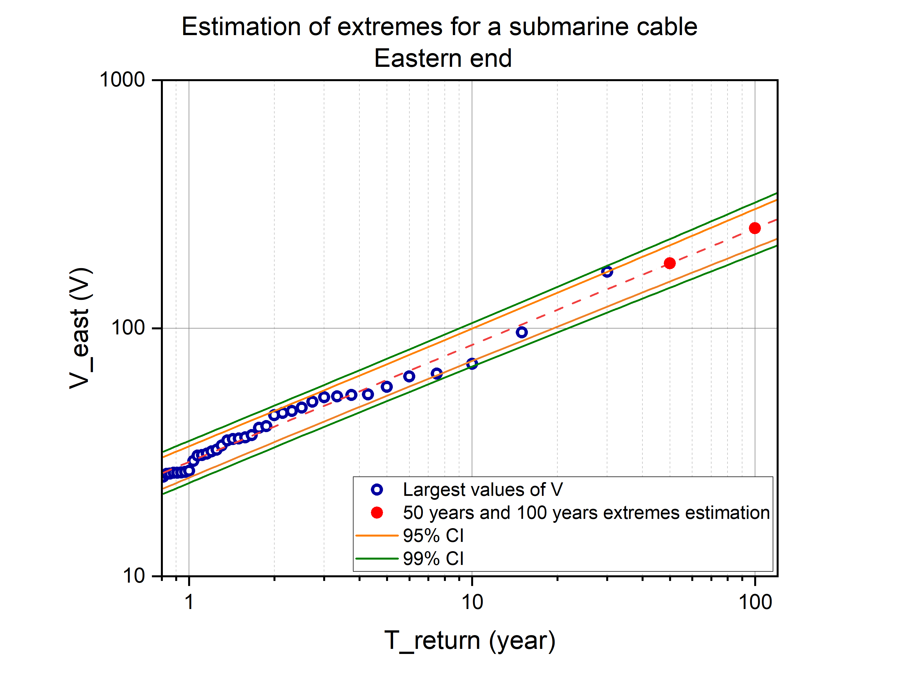

<!-- 
Author(s): Shibaji Chakraborty, Xueling Shi

Disclaimer:
SCUBAS is under the MIT license found in the root directory LICENSE.md 
Everyone is permitted to copy and distribute verbatim copies of this license 
document.

This version of the MIT Public License incorporates the terms
and conditions of MIT General Public License.
-->
# Extreme Value Analysis (EVA) of TAT-8 Cable Voltages

## Overview

Extreme Value Analysis (EVA) offers a practical way to quantify how often damaging voltages might appear on a long-haul submarine cable during severe geomagnetic disturbances (GMDs). Here we revisit the TAT-8 trans-Atlantic system by transforming three decades (1990–2020) of hourly geomagnetic data from Fredericksburg (FRD), St. John’s (STJ), and Hartland (HAD) into induced electric fields with SCUBAS. For each of the TAT-8 western, middle, and eastern sections we extract annual maxima, fit both generalized extreme value and generalized Pareto families, then convert the fitted distributions into return-period curves.

*Figure 1.* The western-termination panel highlights how grounding through the New Jersey land damps—but does not eliminate—extreme potentials. The solid line traces the most likely voltage for each recurrence interval, while the shaded envelope shows the 95 % confidence band. Note the gentle slope up to ~50-year events followed by a sharper rise, indicating that rare storms couple efficiently into the shallow continental shelf.

*Figure 2.* Mid-span sections span multiple deep-ocean conductivity provinces plus the Mid-Atlantic Ridge, so the EVA curve is both steeper and more uncertain. The wide confidence interval reflects variability in oceanic conductivity structure and the amplified electromotive force along the 5,000+ meters deep-water reach. These segments dominate the overall voltage budget during large storms.

*Figure 3.* The eastern part inherits energy transmitted through the entire cable, but the local grounding and higher-conductivity crust slightly compress the extremes relative to the mid-span. Still, the return-period curve shows that century-level events can exceed 300 V at the Cornwall landing, underscoring the need for coordinated protection schemes on both sides of the Atlantic.

## How to interpret the figures

- **Data pedigree** – Each panel reflects SCUBAS runs forced by FRD, STJ, and HAD magnetometer records. Composite electric fields are mapped onto their respective conductivity profiles (CS-W, DO\*, MAR, CS-E) before nodal analysis.
- **Return periods** – Solid traces denote the most likely voltage at any location for a given recurrence interval (e.g., 10-, 50-, 100-year events). Shaded regions capture 95 % confidence limits obtained via profile likelihood sampling.
- **Spatial variation** – The middle segments consistently show the largest spread because they soak up the bulk of the induced electromotive force while also experiencing stronger uncertainty in oceanic conductivity structure.

## Key takeaways

1. **Hundreds of volts are plausible** – Even with “only” three decades of observations, extrapolations point to several-hundred-volt swings under centennial storms. This aligns with the historic 1958 and 1989 events recorded on similar cables.
2. **Terminations matter** – Landfall sections (CS-W/CS-E) exhibit slightly lower extremes owing to the grounding network, yet the EVA still suggests ≥200 V excursions are not exceptional during major storms.
3. **Uncertainty remains large** – The 30-year window is a tiny sample of the Sun’s activity cycle. EVA helps quantify “best guesses,” but confidence bands should be treated as guidance, not guarantees.

In short, EVA supplies a statistically defensible envelope around SCUBAS voltage predictions, enabling operators to benchmark insulation design, relay thresholds, and operational response plans for the next `big one` beneath the Atlantic.
