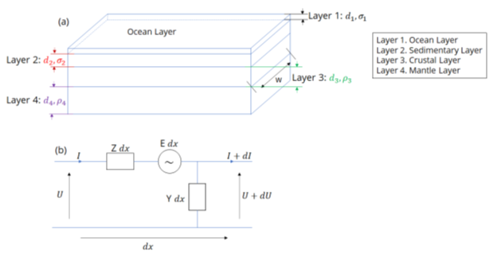

<!-- 
Author(s): Shibaji Chakraborty, Xueling Shi

Disclaimer:
SCUBAS is under the MIT license found in the root directory LICENSE.md 
Everyone is permitted to copy and distribute verbatim copies of this license 
document.

This version of the MIT Public License incorporates the terms
and conditions of MIT General Public License.
-->
#### Transmission Line Modeling (TLM)
---

> In the study of geomagnetic induction, the Earth's conductivity structure plays a crucial role. This structure comprises surface conducting layers, including seawater and sediments, overlaying more resistive layers such as the crust and mantle lithosphere. To simplify the representation of this complex structure, researchers have developed a concept of a thin double layer. This model considers a conductive layer on top followed by a resistive layer underneath. A significant contribution to this field was made by Ranganayaki and Madden in 1980, who introduced a generalized thin sheet analysis specifically designed for frequencies that penetrate through both the conductive and resistive layers. This analysis allows for a comprehensive understanding of the electromagnetic behavior of this layered structure. More recently, Wang et al. in 2023 demonstrated that the generalized thin sheet analysis proposed by Ranganayaki and Madden can be effectively implemented by representing the double layer as a transmission line. This transmission line model incorporates the concept of series impedance, denoted as Z, which takes into account the resistivity and thickness of the conductive layers. Additionally, it considers a parallel impedance, denoted as Y, which accounts for the resistance through the resistive layers. The figure below illustrates the schematic representation of the double-layer structure and its equivalent transmission line model incorporating Z and Y impedances. By employing this transmission line model, researchers can gain valuable insights into the electromagnetic response of the Earth's conductivity structure. This approach allows for a more accurate assessment of the propagation and attenuation of electromagnetic signals through the conductive and resistive layers. The generalized thin sheet analysis, coupled with the transmission line representation, provides a powerful tool for investigating various geophysical phenomena and exploring the behavior of the Earth's subsurface. 

> From theory we understand voltage $V(x)$ and current $I(x)$ along the cable are:
$$
V(x)=\frac{V_ke^{\gamma L}-V_i}{e^{\gamma L}-e^{-\gamma L}}e^{-\gamma (L-x)}+\frac{V_ie^{\gamma L}-V_k}{e^{\gamma L}-e^{-\gamma L}}e^{-\gamma x}\\
I(x)=-\frac{1}{Z_0}\frac{V_ke^{\gamma L}-V_i}{e^{\gamma L}-e^{-\gamma L}}e^{-\gamma (L-x)}+\frac{1}{Z_0}\frac{V_ie^{\gamma L}-V_k}{e^{\gamma L}-e^{-\gamma L}}e^{-\gamma x}+\frac{E}{\gamma Z_0}
$$
where, $\gamma=\sqrt{ZY}$ $Z_0=\sqrt{\frac{Z}{Y}}$. Also, $L$, and $x$ are the length of cable and any random point on the cable.

#### Equivalent-$\pi$ Circuit
> To combine multiple transmission line sections, it is useful to convert each section into  equivalent-$\pi$ circuits (Boteler, 2013) as shown in following figure. 
The equivalent-$\pi$ circuit can be represented with a voltage source, $E'$, and series impedance, $Z'$,  admittances, $Y'/2$, to ground at each end as shown in the figure (Boteler, 2013) with circuit components given by
$$
Z'=Z_0\sinh{\gamma L}
$$